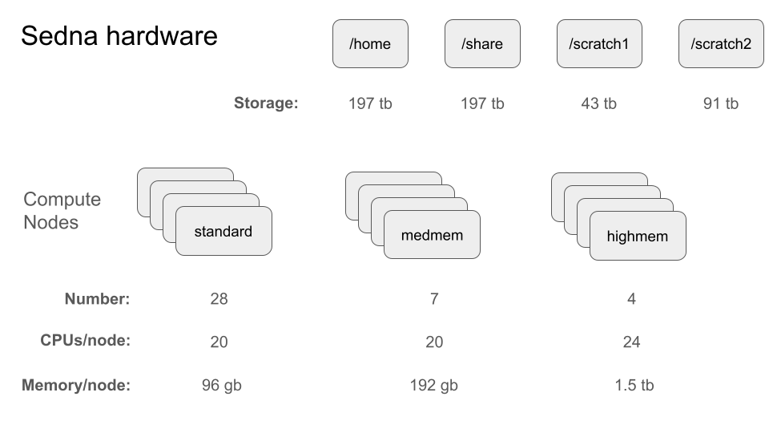
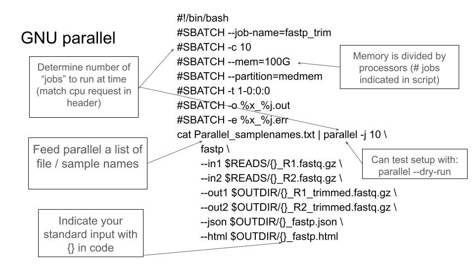
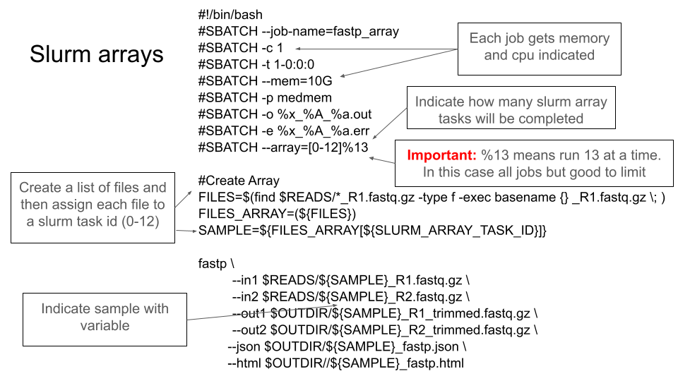
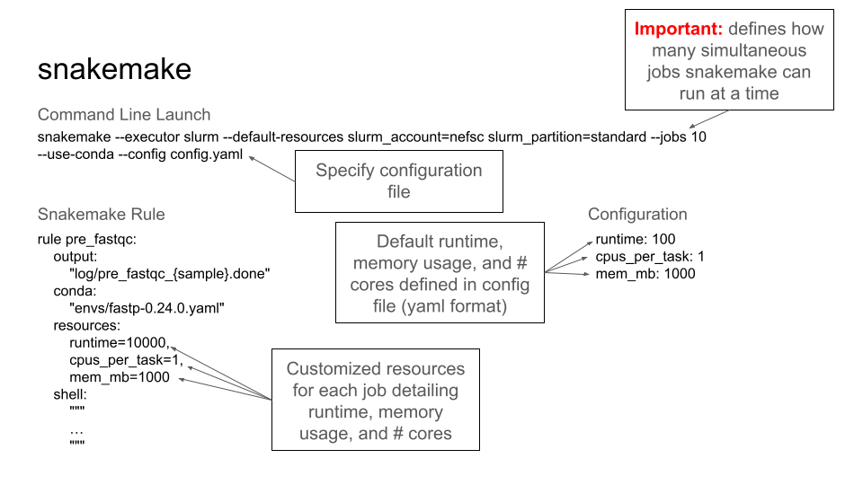
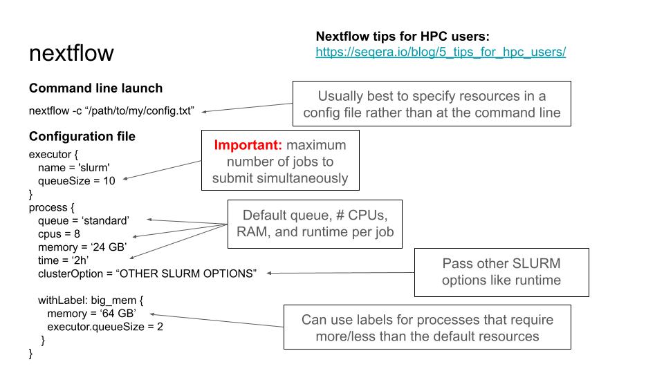

This repo demonstrate how to parallelize jobs, particularly focused on SEDNA. 

[Find the slides from the presentation here.](https://github.com/nmfs-ost/Genomics_Resources/blob/main/tutorials/Parallelization_and_Resource_Use/Presentation.pdf)

For many analyses, we can submit a bunch of different jobs to run in parallel, rather than either sequentially (i.e., in a loop) or as a single large job. This generally makes jobs much faster and more efficient and is the preferred way of doing analysis.

Examples of analyses where you might parallelize might be:

- Bootstrapped phylogenetics
- Phylogenetic gene tree inference
- BLAST
- Trimming and mapping reads
- Replicate MCMCs
- Sliding genomic window analyses
- Genome repeat masking

### HPC architecture

 Computers, even your personal computer, are made up of processors with multiple cores (or CPUs). Each core can run an independent job. Most personal laptops have ~4-10 cores (or even more), which means they could run this many different "jobs" in parallel.
 
 You can run jobs in parallel on your own computer, but HPCs are where parallelization really shines. 

 HPCs generally consist of a headnode, compute nodes, and storage. The head node is where you login, the storage is where you keep your data, and the compute nodes are where the work takes place. Each compute node consists of multiple processors, each of which consists of multiple CPUs/cores. HPCs typically have hundreds or thousands of cores available across multiple nodes, allowing you to scale your analysis from running a few jobs simultaneously to potentially hundreds at once. 
 This  parallelization can reduce analysis time.


### SEDNA resources

For a detailed explanation of sedna resources, [see here](https://docs.google.com/document/d/1nn0T0OWEsQCBoCdaH6DSY69lQSbK3XnPlseyyQuU2Lc/edit?tab=t.0#heading=h.tybq9wkurqk3) But below is a general overview:




### Examples of parallelization

Building on our last tutorial [comparing snakemake and nextflow](https://github.com/nmfs-ost/Genomics_Resources/tree/main/tutorials/Snakemake_Vs_Nextflow), we will show how to run [fastp](https://github.com/OpenGene/fastp) in parallel using:

- nextflow
- snakemake
- parallel
- array (in slurm)

Note that all of these scripts are setup to work on SEDNA, but could be transported to another cluster or your computer with some adjustments.

#### responsible resource use

A key part of these analyses (and any analysis) is determining

1. How many resources are available.
2. How many resources you need
3. Fitting 1 and 2 together in a logical way.

For example, if you're on a clould instance (aws, azure, etc) and request way more CPUs than you can use, you're wasting money. Similarly, if you're on SEDNA or an HPC, occupying a bunch of resoureces will keep anyone else from using them. Some HPCs deal with this automatically (at least how much of the cluster you're requesting at one time). Others, like SEDNA, do not. This is by design so you could use all of SEDNA, say if you're working the in the middle of the night and no one else needs the resources. But typically you want to leave resources for others. 

##### So how many resources do I need?

This is actually kind of hard to answer. Once you run some jobs, you can directly ask how much memory it used, for example using `seff <jobid>` on Slurm. Then next time you run a job, you can adjust (or submit one job as a test before running a batch). 

#### GNU parallel

[GNU parallel](https://www.gnu.org/software/parallel/) allows you to execute multiple jobs simultaneously on a single machine, which can be useful on your own computer or under certain circumstances on an HPC. Note that this is the least parallelizeable approach as you're limited by the direct resources that you request! So they all need to be allocated at once before the job runs. This is different from the other approaches, which submit and run jobs independently. 

In this approach, we're feeding parallel some list and telling it to execute the same job on everything in that list. Basically, we're filling in the blanks in the brackets below from the list:




[See the full script here](https://github.com/nmfs-ost/Genomics_Resources/blob/main/tutorials/Parallelization_and_Resource_Use/Parallel.sh)

#### array jobs

 Job arrays offer a mechanism for submitting and managing collections of similar jobs quickly and easily

Here is a nice and detailed explantion of how to set up an array: https://github.com/nreid/using_array_jobs

[See the full script here](https://github.com/nmfs-ost/Genomics_Resources/blob/main/tutorials/Parallelization_and_Resource_Use/Parallel.sh)



A key idea here is the `$SLURM_ARRAY_TASK_ID` variable, which is set to the task number, in the example above 0-12. Really important is the `%1`3, which limits the number of jobs run simultaneously. For example, if we set `#SBATCH --array=[0-12]%2`, only 2 jobs would be run at once. That is, all are submitted, but the other 11 wait until a job finishes to run. 

We can submit an array of variable like in the example above by identifying the files in a directory. We use find for this in the example, but you could also use `ls *R1_fastq.gz` with some `cut` commands to get the basename. In either case, we're just saying, "grab all the files that end with `R1_fastq.gz`, then we use the base of the sample ID to feed to the array. If you just have a few samples, you could even do: `FILES=(Sample_A.R1.fastq, Sample_B.R1.fastq. Sample_C.R1.fastq)`

Again, see [this link for a nice detailed explanation](https://github.com/nreid/using_array_jobs).


#### snakemake

See the [comparing snakemake and nextflow](https://github.com/nmfs-ost/Genomics_Resources/tree/main/tutorials/Snakemake_Vs_Nextflow) tutorial for how to run this in full. 



#### nextflow

See the [comparing snakemake and nextflow](https://github.com/nmfs-ost/Genomics_Resources/tree/main/tutorials/Snakemake_Vs_Nextflow) tutorial for how to run this in full. 

If we look at the [main.nf](https://github.com/nmfs-ost/Genomics_Resources/blob/main/tutorials/Snakemake_Vs_Nextflow/main.nf) file, which does the work of the analysis, we can specify the input files for our pipeline on line 85: 

```groovy
reads = Channel.fromFilePairs("${params.raw_data_dir}/SRR*_R{1,2}.fastq.gz")
```
 This is similar to the examples above, but handles the file pairs elegantly- it understands that files are identical except for the `R1` or `R2` and groups them into tuples where each sample's forward and reverse reads are kept together throughout the pipeline.

These files are then sent to fastp:

```bash

        fastp -i !{reads[0]} \
            -I !{reads[1]} \
            -o !{reads[0].simpleName}_trimmed.fastq.gz \
            -O !{reads[1].simpleName}_trimmed.fastq.gz

```

- !{reads[0]} refers to the first file in the pair (R1, forward reads)
- !{reads[1]} refers to the second file in the pair (R2, reverse reads)
- The output files use simpleName to strip the file extension and create clean output names

Below is additional information for requesting and limiting resources:




 

 
