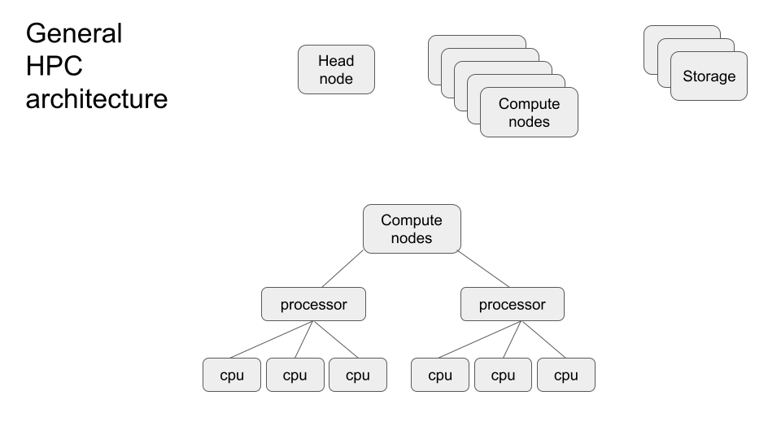

This repo demonstrate how to parallelize jobs, particularly focused on SEDNA. 

For many analyses, we can submit a bunch of different jobs to run in parallel, rather than either sequentially (i.e., in a loop) or as a single large job. This generally makes jobs much faster and more efficient and is the preferred way of doing analysis.

Examples of analyses where you might parallelize might be:

- Bootstrapped phylogenetics
- Phylogenetic gene tree inference
- BLAST
- Trimming and mapping reads
- Replicate MCMCs
- Sliding genomic window analyses
- Genome repeat masking

### HPC architecture

 Computers, even your personal computer, are made up of processors with multiple cores (or CPUs). Each core can run an independent job. Most personal laptops have ~4-10 cores (or even more), which means they could run this many different "jobs" in parallel.
 
 You can run jobs in parallel on your own computer, but HPCs are where parallelization really shines. 

 HPCs generally consist of a headnode, compute nodes, and storage. The head node is where you login, the storage is where you keep your data, and the compute nodes are where the work takes place. Each compute node consists of multiple processors, each of which consists of multiple CPUs/cores. HPCs typically have hundreds or thousands of cores available across multiple nodes, allowing you to scale your analysis from running a few jobs simultaneously to potentially hundreds at once. 
 This  parallelization can reduce analysis time.

 {width=70%}

### Examples of parallelization

Building on our last tutorial [comparing snakemake and nextflow](https://github.com/nmfs-ost/Genomics_Resources/tree/main/tutorials/Snakemake_Vs_Nextflow), we will show how to run [fastp](https://github.com/OpenGene/fastp) in parallel using:

- nextflow
- snakemake
- parallel
- array (in slurm)

Note that all of these scripts are setup to work on SEDNA, but could be transported to another cluster or your computer with some adjustments.

#### GNU parallel

[GNU parallel](https://www.gnu.org/software/parallel/) allows you to execute multiple jobs simultaneously on a single machine, which can be useful on your own computer or on an HPC. 

#### array jobs

#### snakemake

See the [comparing snakemake and nextflow](https://github.com/nmfs-ost/Genomics_Resources/tree/main/tutorials/Snakemake_Vs_Nextflow) tutorial for how to run this in full. 

#### nextflow

See the [comparing snakemake and nextflow](https://github.com/nmfs-ost/Genomics_Resources/tree/main/tutorials/Snakemake_Vs_Nextflow) tutorial for how to run this in full. 

 

 
